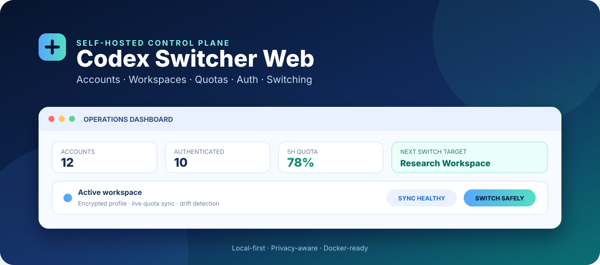
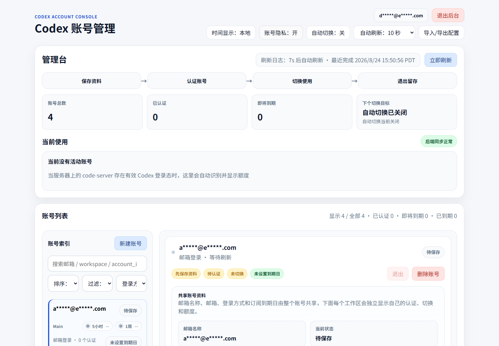
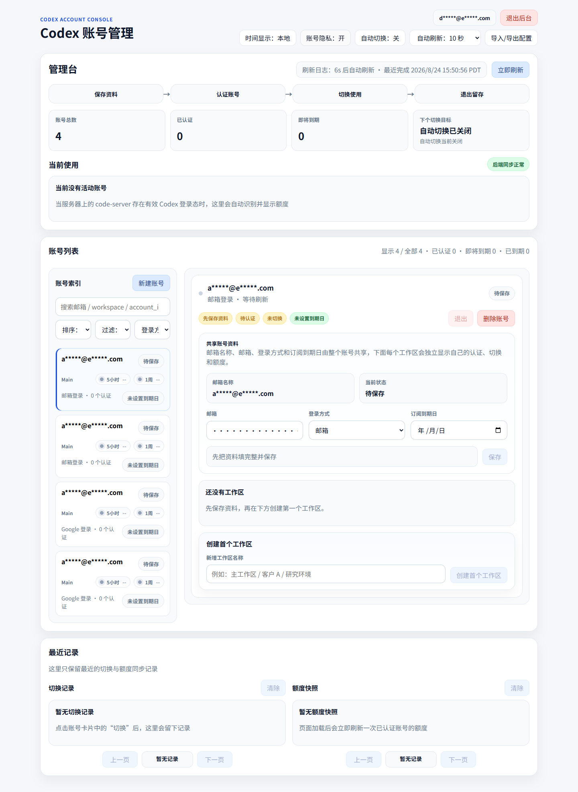
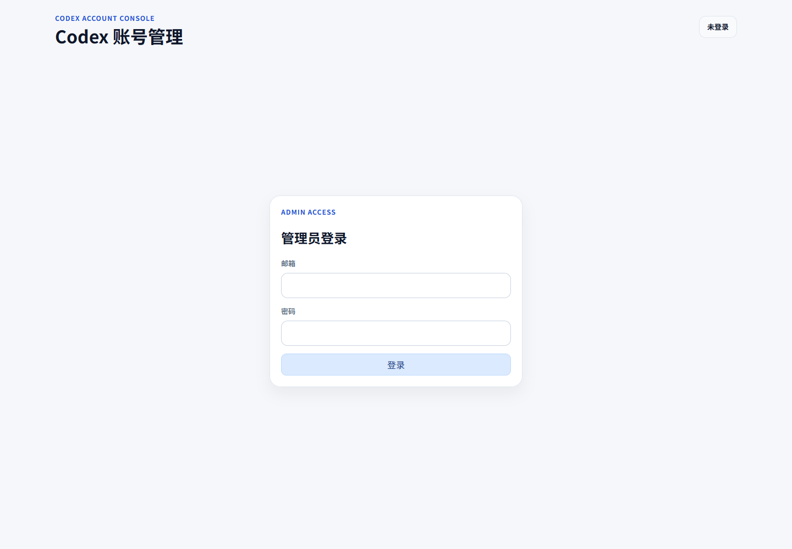
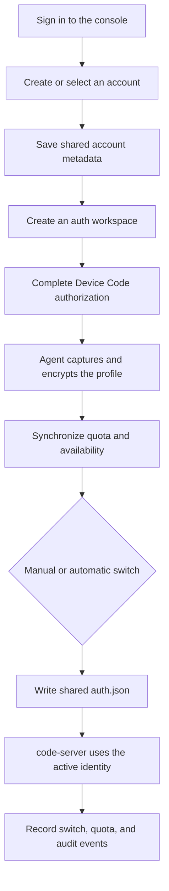
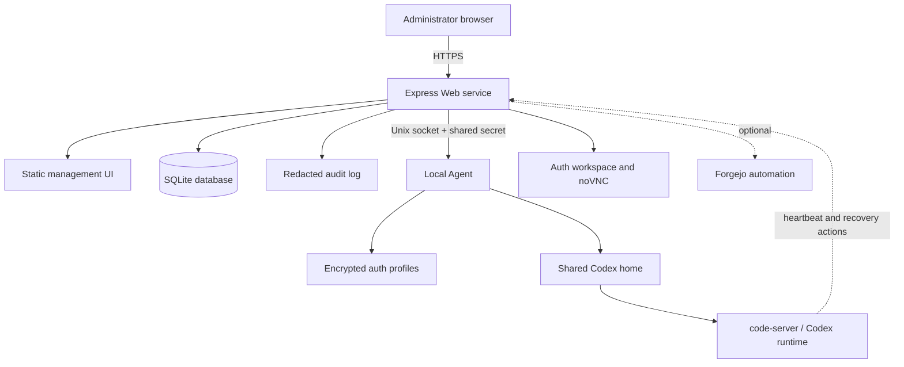

<div align="center">
  

  <sub>Figure 1.1　Accounts, workspaces, quotas, and the active identity converge in one self-hosted control plane</sub>
</div>

<h1 align="center">Codex Switcher Web</h1>

<p align="center">
  A self-hosted Codex console for multiple accounts and workspaces<br />
  Centralize authentication, switching, quotas, drift detection, recovery, and code-server access
</p>

<p align="center">
  <a href="./README.md">简体中文</a> ·
  <a href="./README.en.md"><strong>English</strong></a> ·
  <a href="./docs/ROADMAP.md">Roadmap</a> ·
  <a href="./LICENSE">License</a>
</p>

<p align="center">
  
  
  
  
  
  <br />
  <sub>Version and runtime evidence comes from the package and container baseline [1][2], test status comes from the complete suite [3]</sub>
</p>

> [!IMPORTANT]
> This project processes Codex login material and account metadata, so replace every secret placeholder before deployment and protect the console with HTTPS, access controls, and least privilege, the repository contains only `example.com` domains, sample accounts, and redacted screens

## 1 Project overview

Codex Switcher Web is designed for individuals or teams that operate multiple Codex accounts or workspaces on one server, it brings account metadata, device-code authentication, active identity switching, 5-hour and 1-week quotas, abnormal states, and operational history into one web console

The system has a Web service and a local Agent, the Web service owns the interface, sessions, data, and orchestration, while the Agent uses a local Unix socket to manage the shared `auth.json`, read quotas, and execute authentication tasks, the current release is `0.2.0` [1]

<div align="center">

Table 1.1　Project position

| Dimension | Current implementation | Fit |
| --- | --- | --- |
| Deployment | Self-hosted with Docker Compose | Operators who can maintain a Linux server |
| Main objects | Codex accounts, per-account auth workspaces, and one shared active identity | Multi-account or multi-workspace switching |
| Console | Chinese-first web UI with an account privacy mask | Day-to-day visual operations |
| Integration | Existing code-server or a bundled code-server | Reuse an environment or install a complete stack |
| Data | SQLite, audit logs, encrypted profiles, and a shared Codex home | Requires durable backup and strict file permissions |
| Status | Working prototype with tests for core services and recovery | Requires an environment-level security review before production |

</div>

## 2 Interface preview

These images were produced by the real application in an isolated local environment, sample accounts were used and the privacy mask was enabled, the images contain no production URL, real account, user identifier, token, or password

<div align="center">
  

Figure 2.1　Dashboard overview with account counts, switching flow, active identity, and masked accounts
</div>

<details>
<summary><strong>Expand the complete dashboard</strong></summary>

<br />

<div align="center">
  

Figure 2.2　Complete dashboard with account details, workspace entry points, and recent records
</div>
</details>

<details>
<summary><strong>Expand the administrator sign-in page</strong></summary>

<br />

<div align="center">
  

Figure 2.3　Administrator sign-in page with empty input fields
</div>
</details>

## 3 Core capabilities

<div align="center">

Table 3.1　Implemented capabilities

| Capability | What the operator can do | Evidence |
| --- | --- | --- |
| Multi-account management | Create, edit, search, sort, filter, and delete accounts | `server/app.js`, `public/app.js` |
| Multiple auth workspaces | Keep independent auth workspaces under one account and choose a primary workspace | `server/db.js`, `server/service.js` |
| Device Code authentication | Create, observe, retry, cancel, and remove authentication tasks | `server/agent.js`, `server/auth-workspace-manager.js` |
| Active identity switching | Atomically write the selected profile into the shared Codex identity and retain switch history | `server/agent.js`, `server/service.js` |
| Quota synchronization | Read and display 5-hour and 1-week usage windows and retain samples | `server/quota-parser.js`, `server/service.js` |
| Automatic switching | Select an available workspace after quota exhaustion and raise alerts | `server/service.js` |
| Drift detection | Detect active authentication changes made outside the console | `server/service.js` |
| Interactive recovery | Resume the same task through the browser bridge or open a new task and continue | `server/code-bridge-template.js`, `server/service.js` |
| Encrypted import and export | Protect portable configuration with a short passphrase and merge, replace, or skip conflicts | `server/exchange.js`, `server/security.js` |
| Audit and safeguards | Produce redacted audit events with sessions, CSRF protection, rate limits, and security headers | `server/audit.js`, `server/security.js`, `server/app.js` |
| code-server integration | Connect an existing instance or deploy one through Compose | `deploy/docker-compose.yml.template` |
| Forgejo automation | Optionally accept project commands, batch retries, and pause operations | `server/automation.js` |

</div>

## 4 Operator flow

<div align="center">



Figure 4.1　Account authentication and active identity switching

</div>

The console presents the path as “save metadata → authenticate account → switch for use → sign out and retain”, signing out of an active workspace can preserve its encrypted profile for later use

## 5 Architecture

<div align="center">



Figure 5.1　Runtime components and trust boundaries

</div>

<div align="center">

Table 5.1　Component responsibilities

| Component | Responsibility | Default boundary |
| --- | --- | --- |
| `web` | Console, sessions, API, scheduling, SQLite, and audit | Container port `29000` |
| `agent` | Auth tasks, token refresh, quota reads, and active identity writes | Local Unix socket only |
| `code-server` | Browser development environment | Starts only with the `bundled` profile |
| Nginx | Domain entry point, reverse proxy, and optional HTTPS | Configured by the installer when run as root |
| SQLite | Accounts, auth workspaces, quotas, switches, and recovery state | Persistent data volume |

</div>

## 6 Quick start

### 6.1 Requirements

The installer currently accepts Ubuntu `22.04` or `24.04` and requires `docker`, Docker Compose, `rsync`, and `openssl`, Nginx and Certbot are optional edge components [4]

Step 1, clone the repository and enter the deployment directory

```bash
# Fetch the public repository and enter the directory that contains the installer
git clone https://github.com/AIALRA-0/Codex-Switcher-Web.git # Clone the project source
cd Codex-Switcher-Web/deploy # Enter the deployment directory
```

Step 2, run the interactive installer

```bash
# Collect domains, ports, deployment mode, and initial administrator details
bash install.sh # Generate the environment, Compose, and Nginx files
```

Step 3, inspect the services after installation

```bash
# Check container health and recent startup output from the installation root
cd /opt/codex-switcher-web # Use the actual path if you changed the default during installation
docker compose ps # Inspect Web and Agent container status
docker compose logs --tail=100 web agent # Read the latest 100 lines from both services
```

> [!WARNING]
> The installer synchronizes the repository into the installation root's `app` directory with deletion enabled for that directory, it preserves `data`, `workspace`, and an existing `.env`, but you should still back up the installation root and database before an upgrade

### 6.2 Deployment modes

<div align="center">

Table 6.1　Deployment mode comparison

| Mode | Choose it when | Result |
| --- | --- | --- |
| `external` | An existing code-server should be reused | Starts `web` and `agent`, then stores the external workspace URL |
| `bundled` | This project should provide code-server too | Starts `web`, `agent`, and `code-server` with a shared managed Codex home |

</div>

The installer generates `.env`, `docker-compose.yml`, and `generated/nginx/*.conf`, when it runs as root on a host with Nginx it can also enable the sites and invoke Certbot

## 7 Configuration

The complete placeholder template is [`deploy/env.example`](./deploy/env.example), every domain uses `example.com`, and every password or secret is deliberately unusable

### 7.1 Required secrets

<div align="center">

Table 7.1　First-start configuration

| Setting | Purpose | Requirement |
| --- | --- | --- |
| `SESSION_SECRET` | Sign administrator sessions | At least 24 characters and randomly generated for production |
| `CODEX_PROFILE_ENCRYPTION_KEY` | Encrypt stored auth profiles | At least 24 characters, losing it makes old profiles unreadable |
| `CODEX_AGENT_SHARED_SECRET` | Authenticate Web-to-Agent communication | At least 24 characters and identical for both services |
| `ADMIN_SEED_EMAIL` | Create the first administrator | Used only when no administrator exists |
| `ADMIN_SEED_PASSWORD` | Create the first password hash | Remove it from readable deployment records after first use |

</div>

The application rejects known placeholder secrets and short values, administrator passwords use bcrypt with cost factor `12`, and profiles use AES-256-GCM [5]

### 7.2 Application and runtime

<div align="center">

Table 7.2　Common runtime settings

| Group | Setting | Default or note |
| --- | --- | --- |
| Web | `APP_URL`, `HOST`, `PORT` | Listens on container address `0.0.0.0:29000` by default |
| Cookie | `COOKIE_DOMAIN` or `SESSION_COOKIE_DOMAIN` | The first takes precedence, the second is a compatibility fallback |
| Cookie | `COOKIE_SECURE` | Derives from whether `APP_URL` uses HTTPS when unset |
| Data | `CODEX_SWITCHER_DATA_DIR`, `DB_PATH`, `AUDIT_LOG_PATH` | Compose maps these into `/data` |
| Agent | `CODEX_AGENT_SOCKET_PATH`, `CODEX_ACTIVE_AUTH_PATH` | Control local communication and the shared identity file |
| Quota | `QUOTA_SAMPLE_INTERVAL_MS`, `QUOTA_SYNC_CONCURRENCY` | Control cadence and parallelism |
| Switching | `SWITCH_LOCK_MS`, `AUTO_SWITCH_ENABLED` | Control the lock window and initial automatic-switch state |
| Integration | `CODE_ORIGIN`, `CODE_WORKSPACE_URL` | Use operator-owned domains or workspace addresses |
| Automation | `AUTOMATION_ENABLED`, `FORGEJO_BASE_URL`, `FORGEJO_TOKEN` | Disabled by default, use a least-privilege token when enabled |

</div>

The current `deploy/env.example` still contains `SESSION_SECURE`, `TRUST_PROXY`, and `DEFAULT_UI_LANGUAGE`, but `server/config.js` does not read those keys, `COOKIE_SECURE` is the effective cookie switch and the UI is currently Chinese-first, these differences are known configuration debt [6]

## 8 Data and recovery

<div align="center">

Table 8.1　Persistent objects

| Object | Default location | Recovery value |
| --- | --- | --- |
| SQLite database | `/data/codex-switcher.db` | Accounts, workspaces, quotas, switches, auth tasks, and recovery state |
| Audit log | `/data/audit.log` | Management events with sensitive fields replaced by `[redacted]` |
| Agent backup | `/data/agent` | Profile data saved before an active identity change |
| Auth task directory | `/data/bootstrap` | Isolated authentication task files, treat as sensitive |
| Shared Codex home | Compose volume `codex-home` | Active identity shared by the Agent and code-server |
| Workspace | `workspace` under the installation root | Files used by bundled code-server |

</div>

Back up the database, Agent backup, and shared Codex home together, restoration requires the original `CODEX_PROFILE_ENCRYPTION_KEY`, restoring the database without that key leaves encrypted profiles unreadable

## 9 Security and privacy

Implemented safeguards include:

- Cookie sessions use `httpOnly` and `SameSite=Lax`, HTTPS deployments can enable the Secure attribute
- Mutating requests require a CSRF token, and login and write routes have separate rate limits
- Helmet provides security headers and the Express technology header is disabled
- Stored profiles and portable exports use AES-256-GCM, while export passphrases derive keys through scrypt [5]
- The audit module redacts access tokens, refresh tokens, ID tokens, auth JSON, passwords, and generic token fields
- The account privacy switch masks identity information in the UI, and it was enabled for every README dashboard screenshot

> [!CAUTION]
> The privacy switch affects presentation only, it does not replace database encryption, operating-system permissions, HTTPS, reverse-proxy authentication, or encrypted backups

Operators must also:

- Expose the console only through HTTPS and restrict it to trusted networks or an identity-aware proxy
- Apply least-readable permissions to `.env`, databases, logs, backups, and the shared Codex home
- Use independent random secrets and never commit `.env`, real domains, accounts, user identifiers, tokens, or browser state
- Rotate the administrator password and integration tokens and verify the recovery path after rotation
- Remove or rewrite the four `example.com` accounts seeded into a new database, they contain no real authentication data
- Give Forgejo automation a least-privilege token and restrict proxy API sources before enabling it

## 10 HTTP interface overview

<div align="center">

Table 10.1　Interface groups

| Group | Representative path | Access condition |
| --- | --- | --- |
| Health | `GET /healthz` | No administrator session, returns no sensitive data |
| Administrator session | `/api/auth/login`, `/api/auth/logout` | Login rate limit, logout requires session and CSRF |
| Runtime | `/api/runtime`, `/api/runtime/refresh` | Administrator session, writes require CSRF |
| Accounts and workspaces | `/api/accounts`, `/api/accounts/:id/*` | Administrator session, writes require CSRF |
| Encrypted exchange | `/api/exchange/export`, `/api/exchange/import` | Administrator session, CSRF, and passphrase |
| Browser bridge | `/api/bridge/*` | Separate proxy shared secret |
| Forgejo automation | `/api/forgejo/*` | Separate Forgejo proxy shared secret |
| Live events | `/api/events/stream` | Server-sent events under an administrator session |

</div>

These routes are currently an internal console protocol, the repository does not promise a stable public API version, external integrations should pin a commit and retest before upgrades

## 11 Repository layout

<div align="center">

Table 11.1　Directory guide

| Path | Contents |
| --- | --- |
| `public/` | Sign-in page, dashboard HTML, styles, and browser logic |
| `server/app.js` | Express entry point, sessions, middleware, and HTTP routes |
| `server/agent.js` | Local Agent, auth tasks, shared identity, and quota access |
| `server/service.js` | Quota synchronization, switching, recovery, and runtime orchestration |
| `server/db.js` | SQLite schema, migrations, and data access |
| `server/automation.js` | Forgejo and code-server automation |
| `deploy/` | Installer, Compose, Nginx, and bundled code-server |
| `tests/` | Service tests executed by the Node.js test runner |
| `fixtures/` | Redacted HTML samples for quota parsing tests |
| `docs/ROADMAP.md` | Current, next, and later roadmap |

</div>

## 12 Tests and quality status

Validation used the Dockerfile-aligned Linux and Node.js `22` environment and directed test databases to a writable temporary directory

```bash
# Install locked dependencies and run the complete suite on Linux
npm ci # Install exactly from package-lock.json
CODEX_SWITCHER_DATA_DIR=/tmp/codex-switcher-test npm test # Run every Node.js test
```

<div align="center">

Table 12.1　Verification for this README iteration

| Check | Result | Detail |
| --- | --- | --- |
| Automated tests | 65 / 65 passed [3] | Linux, Node.js 22, isolated writable data directory |
| Real-page check | Passed | Sign-in, privacy switch, dashboard, and layout rendered by the real service |
| README media | Passed | One local hero and three local screenshots |
| Privacy scan | Passed | Screenshots contain sample accounts only, no production credential or private key found |
| Dependency audit | Action required | This run of `npm audit` reports 3 moderate, 5 high, and 1 critical issue [1] |
| Native Windows tests | Unsupported by the current script | `npm test` uses POSIX environment syntax and SQLite cleanup meets Windows file locking |

</div>

## 13 Known limitations

- The interactive installer supports Ubuntu 22.04 and 24.04 only, other systems need manual adaptation [4]
- Quota reads, Device Code authentication, and recovery actions depend on upstream interfaces or behavior and may require maintenance after upstream changes
- The Web and Agent use a single-host shared identity model, multi-node high availability is not implemented
- The UI is Chinese-first and `DEFAULT_UI_LANGUAGE` is not connected to runtime configuration
- `SESSION_SECURE` and `TRUST_PROXY` in the environment template are not connected to current config loading
- Auth workspaces, browser automation, and Forgejo automation need environment-specific network, browser, and permission checks
- Nine dependency audit findings remain [1] and require upgrade testing or recorded risk acceptance before production use

## 14 Roadmap

The original roadmap remains organized into three stages [7]

<div align="center">

Table 14.1　Roadmap

| Stage | Planned work |
| --- | --- |
| Now | Multi-account management, Device Code flow, shared switching, quota sync, privacy mode, drift detection, probes, and token keep-alive |
| Next | Better onboarding, diagnostics and health reporting, more deployment presets, and release automation |
| Later | Desktop GUI companion, account import and export workflows, and optional policy and team management |

</div>

See [`docs/ROADMAP.md`](./docs/ROADMAP.md) for the concise source list

## 15 Contributing

Step 1, open an Issue with the environment, expected result, actual result, and reproduction path, remove real domains, emails, user identifiers, tokens, cookies, passwords, and local paths from logs first

Step 2, create a short branch from `main`, keep the change focused, and add tests for behavior changes

Step 3, run the complete suite under Linux and Node.js 22, then inspect the dashboard and scan for sensitive information

Step 4, open a Pull Request with risk, compatibility, rollback, and verification details

Do not put credentials or exploitable details in a public Issue, use GitHub's private security reporting path for security findings

## 16 License

This project is available under the [MIT License](./LICENSE), dependencies, Codex, code-server, browser extensions, and other third-party components remain subject to their own licenses and terms

## 17 References

[1] AIALRA, “Package manifest and dependency lock,” *Codex Switcher Web*, 2026. [Online]. Available: [`package.json`](./package.json), [`package-lock.json`](./package-lock.json)

[2] AIALRA, “Container runtime baseline,” *Codex Switcher Web*, 2026. [Online]. Available: [`Dockerfile`](./Dockerfile)

[3] AIALRA, “Automated test suite,” *Codex Switcher Web*, 2026. [Online]. Available: [`tests`](./tests)

[4] AIALRA, “Ubuntu deployment installer,” *Codex Switcher Web*, 2026. [Online]. Available: [`deploy/install.sh`](./deploy/install.sh)

[5] AIALRA, “Security implementation,” *Codex Switcher Web*, 2026. [Online]. Available: [`server/security.js`](./server/security.js)

[6] AIALRA, “Runtime configuration implementation,” *Codex Switcher Web*, 2026. [Online]. Available: [`server/config.js`](./server/config.js)

[7] AIALRA, “Project roadmap,” *Codex Switcher Web*, 2026. [Online]. Available: [`docs/ROADMAP.md`](./docs/ROADMAP.md)

---

<p align="center">
  <strong>Codex Switcher Web</strong><br />
  Keep multi-account authentication, quotas, and switching visible, controlled, and auditable
</p>
