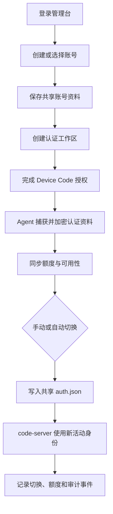
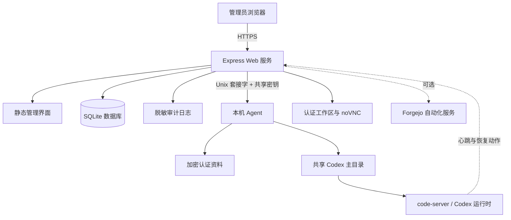

<div align="center">
  

  <sub>图 1.1　账号、工作区、额度和活动身份汇入同一个自托管控制平面</sub>
</div>

<h1 align="center">Codex Switcher Web</h1>

<p align="center">
  面向多账号与多工作区的自托管 Codex 控制台<br />
  统一处理认证、切换、额度、漂移检测、恢复动作与 code-server 接入
</p>

<p align="center">
  <a href="./README.md"><strong>简体中文</strong></a> ·
  <a href="./README.en.md">English</a> ·
  <a href="./docs/ROADMAP.md">路线图</a> ·
  <a href="./LICENSE">许可证</a>
</p>

<p align="center">
  
  
  
  
  
  <br />
  <sub>版本和技术栈依据项目清单与容器基线 [1][2]，测试结果依据完整测试套件 [3]</sub>
</p>

> [!IMPORTANT]
> 本项目会处理 Codex 登录资料与账号元数据，部署前必须替换全部密钥占位符，并通过 HTTPS、访问控制和最小权限保护管理端，仓库内只提供 `example.com`、示例账号和脱敏界面

## 1 项目概览

Codex Switcher Web 适合在一台服务器上管理多个 Codex 账号或工作区的个人与团队，该控制台将账号资料、设备码认证、活动身份切换、5 小时与 1 周额度、异常状态和操作记录集中到一个页面 [1]

项目由 Web 服务和本机 Agent 两部分组成，Web 服务提供管理界面、会话、数据和调度

Agent 通过本机 Unix 套接字管理共享 `auth.json`、读取额度并执行认证任务，当前发布版本为 `0.2.0` [1]

<div align="center">

表 1.1　项目定位

| 维度 | 当前实现 | 适用判断 |
| --- | --- | --- |
| 部署方式 | 自托管，Docker Compose 编排 | 适合能够维护 Linux 服务器的使用者 |
| 主要对象 | Codex 账号、账号下的认证工作区、共享活动身份 | 适合多账号或多工作区切换场景 |
| 管理入口 | 中文 Web 控制台，支持账号隐私遮罩 | 适合日常可视化运维 |
| 集成模式 | 接入已有 code-server，或一并部署 code-server | 可复用现有开发环境，也可独立安装 |
| 数据位置 | SQLite、审计日志、加密认证资料和共享 Codex 主目录 | 需要持久化备份与严格文件权限 |
| 项目状态 | 可运行原型，测试覆盖核心服务与恢复流程 | 上生产前仍需完成环境级安全评审 |

</div>

## 2 界面预览

以下图片来自本地隔离环境中的真实页面，账号使用示例数据并开启隐私遮罩，图片不包含生产网址、真实账号、用户编号、令牌或密码

<div align="center">
  

图 2.1　管理台总览，展示账号统计、切换流程、活动身份和脱敏账号列表
</div>

<details>
<summary><strong>展开完整管理台</strong></summary>

<br />

<div align="center">
  

图 2.2　完整管理台，包含账号详情、工作区入口和最近记录
</div>
</details>

<details>
<summary><strong>展开管理员登录页</strong></summary>

<br />

<div align="center">
  

图 2.3　管理员登录页，输入区域保持空白
</div>
</details>

## 3 核心能力

<div align="center">

表 3.1　已实现能力

| 能力 | 用户可以做什么 | 代码依据 |
| --- | --- | --- |
| 多账号管理 | 创建、编辑、搜索、排序、筛选和删除账号 | `server/app.js`、`public/app.js` |
| 多工作区认证 | 为同一账号维护多个独立认证工作区，并设置主工作区 | `server/db.js`、`server/service.js` |
| Device Code 认证 | 创建、观察、重试、取消和清理认证任务 | `server/agent.js`、`server/auth-workspace-manager.js` |
| 活动身份切换 | 将目标认证资料原子写入共享 Codex 身份位置，并保留切换记录 | `server/agent.js`、`server/service.js` |
| 额度同步 | 读取并展示 5 小时与 1 周用量窗口，记录历史快照 | `server/quota-parser.js`、`server/service.js` |
| 自动切换 | 在额度耗尽时按可用性选择候选工作区，并生成告警 | `server/service.js` |
| 漂移检测 | 识别控制台之外发生的活动认证变化，并同步运行状态 | `server/service.js` |
| 交互恢复 | 通过浏览器桥接恢复同一任务，或打开新任务继续执行 | `server/code-bridge-template.js`、`server/service.js` |
| 加密导入导出 | 使用短口令加密可移植配置，支持合并、覆盖与跳过冲突 | `server/exchange.js`、`server/security.js` |
| 审计与防护 | 记录脱敏审计事件，提供会话、CSRF、限流和安全响应头 | `server/audit.js`、`server/security.js`、`server/app.js` |
| code-server 集成 | 连接已有实例，或由 Compose 一并部署实例 | `deploy/docker-compose.yml.template` |
| Forgejo 自动化 | 可选接收项目命令、批次重试和暂停操作 | `server/automation.js` |

</div>

## 4 使用流程

<div align="center">



图 4.1　账号认证与活动身份切换流程

</div>

控制台中的主线提示为“保存资料 → 认证账号 → 切换使用 → 退出留存”

退出某个活动工作区时，系统可保留对应加密资料，后续无需重复填写账号元数据

## 5 系统架构

<div align="center">



图 5.1　运行时组件与信任边界

</div>

<div align="center">

表 5.1　组件职责

| 组件 | 主要职责 | 默认边界 |
| --- | --- | --- |
| `web` | 管理界面、会话、API、调度、SQLite 与审计 | 容器内端口 `29000` |
| `agent` | 认证任务、令牌刷新、额度读取、活动身份写入 | 仅通过本机 Unix 套接字通信 |
| `code-server` | 浏览器中的开发环境 | 仅在 `bundled` 配置下启动 |
| Nginx | 域名入口、反向代理与可选 HTTPS | 安装器在具备 root 权限时配置 |
| SQLite | 账号、认证工作区、额度、切换和恢复状态 | 默认位于持久化数据卷 |

</div>

## 6 快速开始

### 6.1 环境要求

安装器当前只接受 Ubuntu `22.04` 或 `24.04`，并要求 `docker`、Docker Compose、`rsync` 与 `openssl`，Nginx 和 Certbot 属于可选入口组件 [4]

- 第一步，克隆仓库并进入部署目录

```bash
# 获取公开仓库并进入安装脚本所在目录
git clone https://github.com/AIALRA-0/Codex-Switcher-Web.git # 克隆项目源码
cd Codex-Switcher-Web/deploy # 进入部署目录
```

- 第二步，运行交互式安装器

```bash
# 启动交互式安装流程
bash install.sh # 生成环境文件、Compose 文件和 Nginx 配置
```

- 第三步，完成部署后检查服务

```bash
# 检查部署结果
cd /opt/codex-switcher-web # 进入默认安装目录，若安装时改过路径则使用实际路径
docker compose ps # 检查 Web 与 Agent 容器状态
docker compose logs --tail=100 web agent # 检查最近 100 行启动日志
```

> [!WARNING]
> 安装脚本会将仓库内容同步到安装目录的 `app` 子目录，并对该子目录执行删除式同步，`data`、`workspace` 与已有 `.env` 会保留，升级前仍应备份安装目录和数据库

### 6.2 两种部署模式

<div align="center">

表 6.1　部署模式比较

| 模式 | 选择条件 | 安装结果 |
| --- | --- | --- |
| `external` | 已有 code-server，希望复用现有工作区 | 启动 `web` 与 `agent`，保存外部工作区地址 |
| `bundled` | 希望项目一并提供 code-server | 启动 `web`、`agent` 与 `code-server`，共享受管 Codex 主目录 |

</div>

安装器会生成 `.env`、`docker-compose.yml` 与 `generated/nginx/*.conf`，若以 root 运行且系统已有 Nginx，它还会启用站点配置并可调用 Certbot 申请证书

## 7 配置

完整占位模板位于 [`deploy/env.example`](./deploy/env.example)，其中所有域名均为 `example.com`，所有密钥和密码均为不可直接使用的占位值

### 7.1 必需密钥

<div align="center">

表 7.1　首次启动所需配置

| 配置 | 用途 | 要求 |
| --- | --- | --- |
| `SESSION_SECRET` | 签名管理员会话 | 至少 24 个字符，生产环境随机生成 |
| `CODEX_PROFILE_ENCRYPTION_KEY` | 加密保存的认证资料 | 至少 24 个字符，丢失后无法解密旧资料 |
| `CODEX_AGENT_SHARED_SECRET` | 验证 Web 与 Agent 通信 | 至少 24 个字符，Web 与 Agent 必须一致 |
| `ADMIN_SEED_EMAIL` | 首次启动创建管理员 | 仅在数据库没有管理员时使用 |
| `ADMIN_SEED_PASSWORD` | 首次启动创建密码哈希 | 使用后应从可读取的部署记录中清理 |

</div>

应用会拒绝已知占位密钥和过短密钥

代码将 bcrypt 的成本参数固定为 `12`，认证资料使用 AES-256-GCM 加密 [5]

### 7.2 运行参数

<div align="center">

表 7.2　常用运行参数

| 分组 | 配置 | 默认值或说明 |
| --- | --- | --- |
| Web | `APP_URL`、`HOST`、`PORT` | 默认监听容器内 `0.0.0.0:29000` |
| Cookie | `COOKIE_DOMAIN` 或 `SESSION_COOKIE_DOMAIN` | 前者优先，后者作为兼容回退 |
| Cookie | `COOKIE_SECURE` | 未设置时根据 `APP_URL` 是否为 HTTPS 自动决定 |
| 数据 | `CODEX_SWITCHER_DATA_DIR`、`DB_PATH`、`AUDIT_LOG_PATH` | Compose 默认映射到 `/data` |
| Agent | `CODEX_AGENT_SOCKET_PATH`、`CODEX_ACTIVE_AUTH_PATH` | 控制本机通信与共享认证文件位置 |
| 额度 | `QUOTA_SAMPLE_INTERVAL_MS`、`QUOTA_SYNC_CONCURRENCY` | 控制同步频率和并发数 |
| 切换 | `SWITCH_LOCK_MS`、`AUTO_SWITCH_ENABLED` | 控制切换互斥时间与默认自动切换状态 |
| 集成 | `CODE_ORIGIN`、`CODE_WORKSPACE_URL` | 使用部署者自己的域名或工作区地址 |
| 自动化 | `AUTOMATION_ENABLED`、`FORGEJO_BASE_URL`、`FORGEJO_TOKEN` | 默认关闭，启用前单独配置最小权限令牌 |

</div>

当前 `deploy/env.example` 仍保留 `SESSION_SECURE`、`TRUST_PROXY` 与 `DEFAULT_UI_LANGUAGE`，当前 `server/config.js` 不读取这三个键

实际 Cookie 安全开关使用 `COOKIE_SECURE`，界面当前以中文为主，这些差异属于已知配置债务 [6]

## 8 持久化数据

<div align="center">

表 8.1　持久化对象

| 对象 | 默认位置 | 恢复价值 |
| --- | --- | --- |
| SQLite 数据库 | `/data/codex-switcher.db` | 保存账号、工作区、额度、切换、认证任务和恢复状态 |
| 审计日志 | `/data/audit.log` | 追踪管理事件，敏感字段会在写入前替换为 `[redacted]` |
| Agent 备份 | `/data/agent` | 保存活动身份切换前的备份资料 |
| 认证临时目录 | `/data/bootstrap` | 保存认证任务隔离目录，应按敏感数据管理 |
| 共享 Codex 主目录 | Compose 命名卷 `codex-home` | 供 Agent 与 code-server 共享当前活动身份 |
| 工作区 | 安装目录下的 `workspace` | 供 bundled code-server 使用 |

</div>

备份时应同时保存数据库、Agent 备份和共享 Codex 主目录，恢复时必须继续使用原 `CODEX_PROFILE_ENCRYPTION_KEY`，只恢复数据库而丢失密钥会使加密认证资料无法解密

## 9 安全隐私

项目已经实现以下防护：

- Cookie 会话使用 `httpOnly` 与 `SameSite=Lax`，HTTPS 场景可启用 Secure 属性
- 写操作要求 CSRF 令牌，登录与写接口分别实施速率限制
- Helmet 提供内容安全策略等响应头，Express 技术标识被关闭
- 认证资料与可移植导出均使用 AES-256-GCM，导出口令通过 scrypt 派生密钥 [5]
- 审计模块会遮盖访问令牌、刷新令牌、身份令牌、认证 JSON、密码和通用令牌字段
- 账号隐私开关会遮盖界面中的邮箱等身份信息，README 截图已开启该开关

> [!CAUTION]
> 账号隐私开关只控制界面显示，它不替代数据库加密、操作系统权限、HTTPS、反向代理鉴权或备份加密

部署者还需要完成以下事项：

- 仅通过 HTTPS 暴露管理端，并限制可信网络或身份代理访问
- 将 `.env`、数据库、日志、备份和共享 Codex 主目录设为最小可读权限
- 使用独立随机密钥，不把 `.env`、真实域名、账号、用户编号、令牌或浏览器状态提交到 Git
- 定期轮换管理员密码和集成令牌，并验证轮换后的恢复流程
- 删除或改写首次启动自动创建的 4 个 `example.com` 示例账号，它们不包含真实认证资料
- 启用 Forgejo 自动化前，为令牌设置最小仓库权限，并限制代理接口来源

## 10 HTTP 接口概览

<div align="center">

表 10.1　接口分组

| 分组 | 代表路径 | 访问条件 |
| --- | --- | --- |
| 健康检查 | `GET /healthz` | 无管理员会话要求，不返回敏感数据 |
| 管理员会话 | `/api/auth/login`、`/api/auth/logout` | 登录限流，退出要求会话与 CSRF |
| 运行状态 | `/api/runtime`、`/api/runtime/refresh` | 管理员会话，写操作要求 CSRF |
| 账号与工作区 | `/api/accounts`、`/api/accounts/:id/*` | 管理员会话，写操作要求 CSRF |
| 加密交换 | `/api/exchange/export`、`/api/exchange/import` | 管理员会话、CSRF 与口令 |
| 浏览器桥接 | `/api/bridge/*` | 独立代理共享密钥 |
| Forgejo 自动化 | `/api/forgejo/*` | 独立 Forgejo 代理共享密钥 |
| 实时事件 | `/api/events/stream` | 管理员会话下的服务器发送事件连接 |

</div>

接口当前是管理台内部协议，仓库没有承诺稳定的公共 API 版本，外部集成应锁定提交版本并在升级前回归验证

## 11 项目结构

<div align="center">

表 11.1　目录导航

| 路径 | 内容 |
| --- | --- |
| `public/` | 登录页、管理台 HTML、样式与浏览器逻辑 |
| `server/app.js` | Express 入口、会话、中间件和 HTTP 路由 |
| `server/agent.js` | 本机 Agent、认证任务、共享身份与额度访问 |
| `server/service.js` | 额度同步、切换、恢复与运行快照编排 |
| `server/db.js` | SQLite 表结构、迁移和数据访问 |
| `server/automation.js` | Forgejo 与 code-server 自动化 |
| `deploy/` | 安装器、Compose、Nginx 与 bundled code-server |
| `tests/` | Node.js 内置测试运行器覆盖的服务测试 |
| `fixtures/` | 额度解析测试所需的脱敏 HTML 样本 |
| `docs/ROADMAP.md` | 当前、下一阶段和远期路线图 |

</div>

## 12 验证结果

验证使用 Dockerfile 对应的 Linux 与 Node.js `22` 环境，并将测试数据库定向到可写的临时目录

```bash
# 在 Linux 环境安装锁定依赖并运行完整测试套件
npm ci # 按 package-lock.json 安装依赖
CODEX_SWITCHER_DATA_DIR=/tmp/codex-switcher-test npm test # 运行全部 Node.js 测试
```

<div align="center">

表 12.1　本次 README 迭代的验证结果

| 检查 | 结果 | 说明 |
| --- | --- | --- |
| 自动化测试 | 65 / 65 通过 [3] | Linux、Node.js 22、独立可写数据目录 |
| 真实页面检查 | 通过 | 登录、隐私开关、管理台与响应式布局均由真实服务渲染 |
| README 资源 | 通过 | 主视觉和 3 张截图均为仓库内本地文件 |
| 隐私检查 | 通过 | 截图只含示例账号，仓库未发现生产凭据或私钥 |
| 依赖审计 | 需处理 | 本次 `npm audit` 报告 3 个中危、5 个高危和 1 个严重问题 [1]，升级前应逐项评估 |
| Windows 原生测试 | 不支持当前脚本 | `npm test` 使用 POSIX 环境变量写法，SQLite 测试清理在 Windows 上会遇到文件占用 |

</div>

## 13 已知限制

- 交互式安装器只支持 Ubuntu 22.04 与 24.04，未列出的系统需要手动适配 [4]
- 额度读取、设备码认证与恢复动作依赖上游界面或接口行为，上游变化可能要求同步维护
- Web 与 Agent 面向单机共享身份模型设计，多节点高可用尚未实现
- 当前界面以中文为主，`DEFAULT_UI_LANGUAGE` 尚未接入运行时配置
- 当前环境模板中的 `SESSION_SECURE` 与 `TRUST_PROXY` 尚未接入配置读取
- 认证工作区、浏览器自动化与 Forgejo 自动化需要额外的网络、浏览器和权限验证
- 依赖审计仍有 9 项已知告警 [1]，生产部署前应完成升级、测试与风险接受记录

## 14 路线图

当前路线图保留仓库已有的三个阶段 [7]

<div align="center">

表 14.1　路线图

| 阶段 | 计划内容 |
| --- | --- |
| Now | 多账号、Device Code、共享切换、额度同步、隐私模式、漂移检测、探测与令牌保活 |
| Next | 更好的首次使用引导、诊断与健康报告、更多部署预设、发布自动化 |
| Later | 桌面 GUI 配套、账号导入导出工作流、可选策略与团队管理 |

</div>

详细清单见 [`docs/ROADMAP.md`](./docs/ROADMAP.md)

## 15 贡献指南

- 第一步，先创建 Issue，说明运行环境、期望行为、实际行为和可复现步骤，日志必须先移除真实域名、邮箱、用户编号、令牌、Cookie、密码和本机路径

- 第二步，从 `main` 创建短分支，保持单次改动范围清晰，并为行为变化补充测试

- 第三步，在 Linux 与 Node.js 22 环境运行完整测试，同时检查管理台截图和敏感信息扫描

- 第四步，提交 Pull Request，写明风险、兼容性、回滚方式和验证结果

安全问题不要在公开 Issue 中附带凭据或可利用细节，请先使用 GitHub 的私密安全报告渠道联系维护者

## 16 许可证

本项目采用 [MIT License](./LICENSE)，依赖、Codex、code-server、浏览器扩展和其他第三方组件分别遵循其自身许可证与服务条款

## 17 参考资料

[1] AIALRA, “Package manifest and dependency lock,” *Codex Switcher Web*, 2026. [Online]. Available: [`package.json`](./package.json), [`package-lock.json`](./package-lock.json)

[2] AIALRA, “Container runtime baseline,” *Codex Switcher Web*, 2026. [Online]. Available: [`Dockerfile`](./Dockerfile)

[3] AIALRA, “Automated test suite,” *Codex Switcher Web*, 2026. [Online]. Available: [`tests`](./tests)

[4] AIALRA, “Ubuntu deployment installer,” *Codex Switcher Web*, 2026. [Online]. Available: [`deploy/install.sh`](./deploy/install.sh)

[5] AIALRA, “Security implementation,” *Codex Switcher Web*, 2026. [Online]. Available: [`server/security.js`](./server/security.js)

[6] AIALRA, “Runtime configuration implementation,” *Codex Switcher Web*, 2026. [Online]. Available: [`server/config.js`](./server/config.js)

[7] AIALRA, “Project roadmap,” *Codex Switcher Web*, 2026. [Online]. Available: [`docs/ROADMAP.md`](./docs/ROADMAP.md)

---

<p align="center">
  <strong>Codex Switcher Web</strong><br />
  让多账号认证、额度与切换保持可见、可控、可审计
</p>
